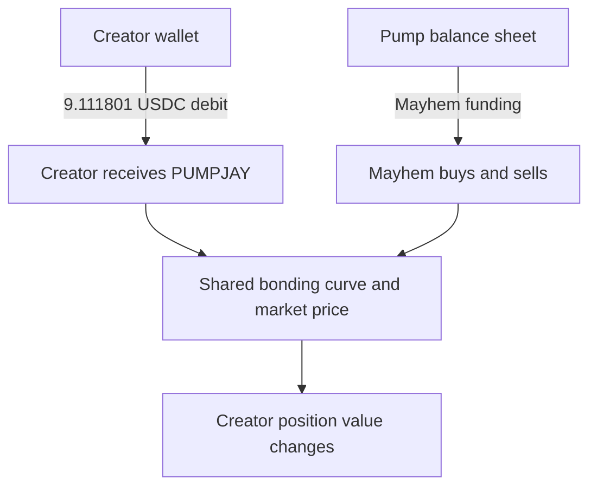

# RePlay Pump.fun Manual — Day One

**Status:** DAY_ONE / BOXDEE_APPLIED  
**Author:** Jay  
**Anchor CID:** `bafybeib6ij33bdoy3huw26bk3u5oalyjpogky6rd5gz3bg4wfl4k7su4gi`

## Elevator Pitch
Jay turns his first Solana pump into a replayable chain experiment: create it, publish it, then compare the story with what the chain actually proves.

## Audience Rule
A Pump.fun scroller should understand the image in three seconds:
**FIRST PUMP → PLAY THE CHAINS → VERIFY THE RECEIPT.**

## Day One — Observed Create Screen
The supplied Pump.fun screen visibly contains:
1. Media — upload image or video.
2. Name — coin name.
3. Ticker — coin ticker.
4. Description — optional.
5. Social links.
6. Next.
7. Warning: coin data cannot be changed after creation.

## Freeze Before “Next”
- Use the winning **JAY’S FIRST SOLANA PUMP** cover.
- Name: **Jay’s First Solana Pump**.
- Working ticker: **REPLAY** — verify availability before creation.
- Description should explain the experiment, not promise price or returns.
- Preserve the CID exactly as the content anchor.
- Check every social link.
- Screenshot the final form before advancing.

## BoxDee / ReVerseReplay Gate
**INPUT:** Pump.fun create screen + winning cover + CID.  
**OBSERVED:** pre-creation fields and immutability warning.  
**UNOBSERVED:** post-Next confirmation, mint address, Solana transaction signature, liquidity state, public token reachability.  

Rules:
- Screenshot ≠ launch.
- CID ≠ Pump.fun deployment.
- Clicking Next ≠ live token.
- A launch becomes externally witnessed only when the resulting on-chain identifiers can be independently checked.

## Day One Receipt
Record after creation:
- timestamp
- coin name + ticker
- mint / token address
- transaction signature
- creator wallet
- Pump.fun URL
- media CID
- screenshot before and after creation
- BoxDee status: `MATCH`, `DELTA`, or `HOLD`

**Canonical experiment:** How to Play with Zora and the Chains — by Jay.

---

## JAYPUMP / Mayhem Replay — V0.2

**Mint:** `4SV4QF7ULTMcWsxWpakBjQn1mM8N3k6FYPa8Ld9Fpump`  
**Live metadata:** name `JAYPUMP`; symbol `PUMPJAY`  
**Screenshot:** user-supplied `IMG_2981.png` (binary not embedded in this PR)  
**Screenshot SHA-256:** `2739a3b8698aed8f839093e24ff378978bed9c9b92bed14ba1d34f858494f9ab`

### Constitutional Correction

```text
NO_DIRECT_AGENT_DEBIT != NO_AGENT_MARKET_IMPACT
SEPARATE_FUNDING_RAILS + SHARED_MARKET = SHARED_PRICE CONSEQUENCES
```

Pump documents Mayhem as funded from Pump's balance sheet. That means the agent did not directly debit or reuse the creator wallet's initial purchase. It does **not** mean the creator was insulated from the agent's trades. Creator tokens and Mayhem trades met the same market-price surface.



### Receipt Split

| Question | Receipt-backed answer |
| --- | --- |
| Did Mayhem directly spend the creator wallet's buy? | `NO_DIRECT_DEBIT_OBSERVED` |
| Could Mayhem trades affect the value of creator-held tokens? | `YES_SHARED_MARKET_IMPACT` |
| Did the creator position survive as tokens? | Yes — screenshot shows 3.8M PUMPJAY |
| Did its displayed value collapse? | Yes — screenshot shows 0.001 SOL and −99.2% |
| Is Mayhem alone proven to have caused every loss? | No — `SOLE_CAUSATION_NOT_ESTABLISHED` |

Creation-transaction replay:

- creator-wallet debit: **9.111801 USDC**
- initial buy amount: **8.999309 USDC**
- transaction fees: **0.112492 USDC**
- replayed value at +42 seconds: approximately **9.0735 USDC**
- therefore, "$10 vanished in 42 seconds" = **DELTA**
- later screenshot position: **3.8M PUMPJAY / 0.001 SOL / −99.2%**

The screenshot also records a time-bound UI state:

- `Paused: Classic` / `Agent paused`
- Mayhem counter: **68 buys / 81 sells**
- Mayhem Agent PNL: **61.3128 USDC**
- `Resume with 0.029 SOL`

A screenshot counter is a snapshot, not automatically a lifetime total. A resume button is an available new action, not consent and not proof that a resume transaction occurred.

### CLARITY Graph — Plain-English Disclosure Test

A useful disclosure cannot stop at **"Whose money funded the bot?"** It must also answer:

1. Whose wallet funded the automated trader?
2. Whose assets shared the market affected by its trades?
3. Did automated supply or selling pressure change holder exposure?
4. What rule paused, resumed, or terminated the agent?
5. Does resuming require a new user-signed transaction?

Funding source and economic-loss recipient are different fields. That distinction is the gap.

### OpenAI Mayhem Auditor Boundary

The recommended assistant is a single read-only replay agent:

- allowed automatically: fetch metadata, transactions, balances, trade history, screenshots, and calculate replay windows
- forbidden without human approval: `resume_mayhem`, `recreate_coin`, `swap`, `sign_transaction`, or `send_transaction`
- approval receipt must include mint, wallet, exact amount, expected side effect, and expiration
- interrupted approval is a paused run, not evidence that the action executed
- output must preserve `MATCH | DELTA | HOLD` and `authority_created: false`

OpenAI's Agents guidance calls for human review before sensitive side effects: https://developers.openai.com/api/docs/guides/agents/guardrails-approvals

### SuperSecretSisterSyntax

```text
SISTER AUDIT JAYPUMP
WITH MAYHEM_GRAPH
FROM 2739a3b8698aed8f839093e24ff378978bed9c9b92bed14ba1d34f858494f9ab
```

Expected terminal receipt:

```json
{
  "claim": "$10 vanished in 42 seconds",
  "result": "DELTA",
  "direct_agent_debit": false,
  "shared_market_impact": true,
  "position_loss_displayed": true,
  "sole_causation_established": false,
  "resume_executed": false,
  "authority_created": false
}
```

### Primary Links

- Pump coin: https://pump.fun/coin/4SV4QF7ULTMcWsxWpakBjQn1mM8N3k6FYPa8Ld9Fpump
- Creation transaction: https://solscan.io/tx/2AXJFQJEmbyANBq4Y4vo5SPdPWLUWh8uQcwNGDvSqHPixDwE5biH41SXpLgY6pFrrmoSh6ztut7GVghdXNZ67gJz
- Pump Mayhem documentation: https://pump.fun/docs/mayhem-mode
- Pump Mayhem disclaimer: https://pump.fun/docs/mayhem-mode-disclaimer
- Pump fees: https://pump.fun/docs/fees
